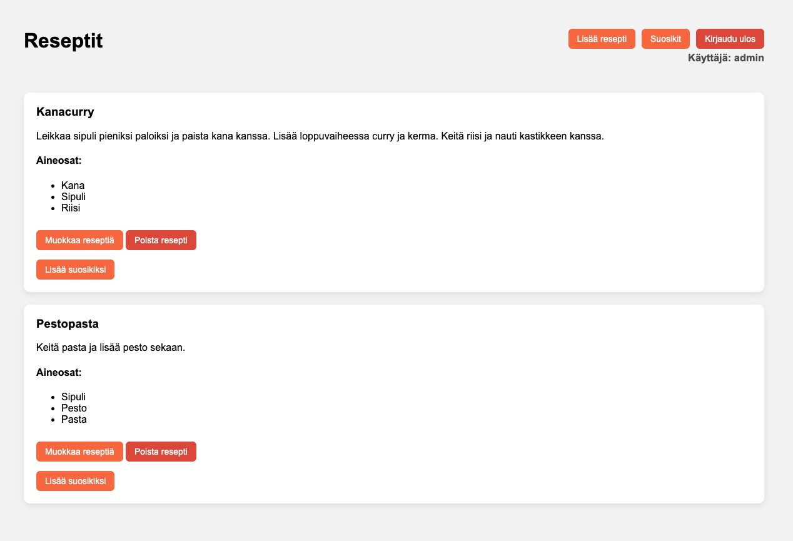
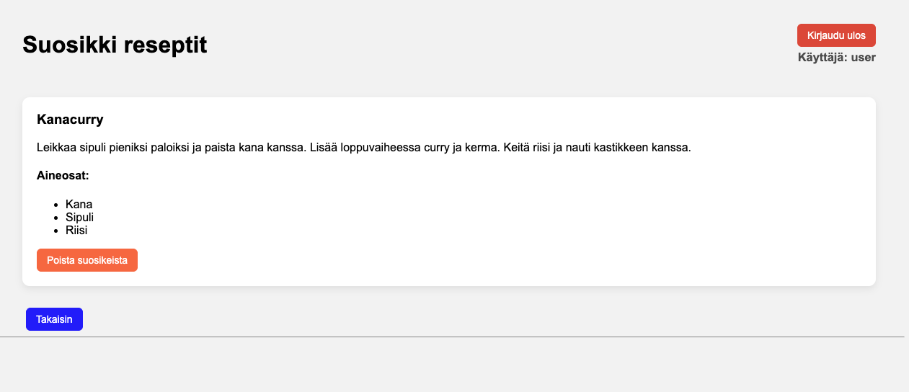
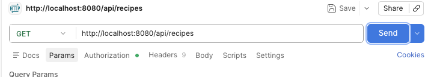
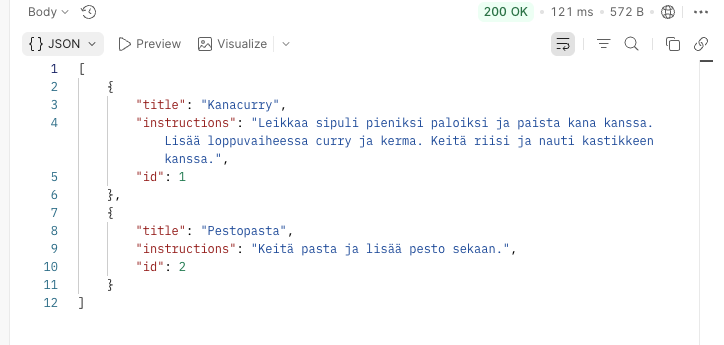
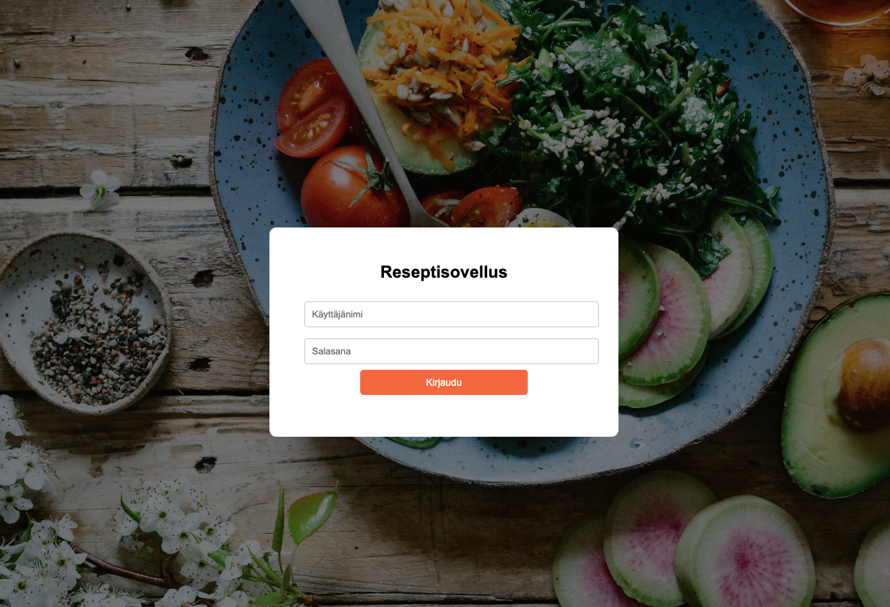

# Recipe Application

## Project Description

This is a backend application built with Java Spring Boot. For database I used PostgreSQL and H2 in testing.

It demonstrates MVC and REST controllers, relational database design and deployment using Docker.

The application allows users to browse recipes and manage favorites, while admins have full control over recipe data.

## Key Features

- Spring Boot backend with both MVC and REST controllers
- Role-based access control (Admin & User)
- Secure password storage using BCrypt hashing
- Full CRUD operations for recipes (Admin)
- Users can browse recipes and manage favourites
- Input validation using @Valid
- REST API for external access
- Dockerized deployment

## User Roles

### Admin

- Create, edit and delete recipes

Below screenshot of admin frontpage:



### User

- View recipes
- Add and remove favourite recipes

Below screenshot of user favourites page:



## API Endpoints

| Method | Endpoint          | Description       |
| ------ | ----------------- | ----------------- |
| GET    | /api/recipes      | Get all recipes   |
| GET    | /api/recipes/{id} | Get recipe by id  |
| POST   | /api/recipes      | Create new recipe |
| PUT    | /api/recipes/{id} | Update recipe     |
| DELETE | /api/recipes/{id} | Delete recipe     |

### API testing

Postman GET request and JSON response:





## Database

- PostgreSQL is used as the primary database
- H2 in-memory database is used for testing
- Users <-> Recipes (Many-to-Many relationship implemented through a favourites feature, allowing users to save personal recipe collections)
- Recipes <-> Ingredients (One-to-Many relationship implemented via a recipe_ingredient join table)

## Security

- Spring Security authentication
- Role-based authorization using @PreAuthorize
- Passwords are hashed using BCrypt

Below screenshot of Login page:



## Validation

- Recipe title: cannot be empty
- Recipe instructions: cannot be empty
- Validation handled using @Valid and BindingResult

## Testing

- Unit and integration tests implement using JUnit
- Repository testing with @DataJpaTest
- API testing using MockMvc
- H2 in-memory database for tests

## Installation and Running

### Requirements

- Java 17+
- Maven
- PostgreSQL

### Run locally

```bash
git clone https://github.com/LopJul/recipeapp-project.git
cd recipeapp-project
mvn spring-boot:run
```

Runs on:
http://localhost:8080

## Deployment

- Deployed on Render using Dockerfile

## Technologies Used

### Backend

- Java
- Spring Boot
- Spring Security
- PostgreSQL
- H2 (testing)
- Docker

## Notes

- This project was created as a part of a backend development course
- Demonstrates relational database modeling with multiple entity relationships
- Favourites feature implemented using Many-to-Many relationship
- MVC (Thymeleaf) and REST API in the same application
